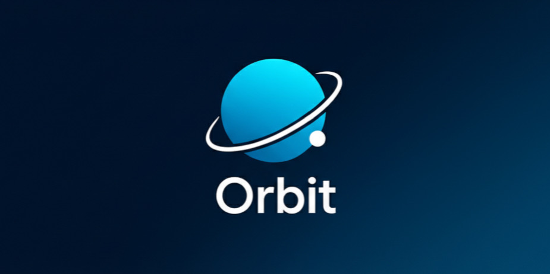

# Orbit - The Calendar That Builds Itself

<div align="center">



**Capture dates from any webpage and build a smart calendar automatically**

[](https://chrome.google.com/webstore)
[](https://spring.io/projects/spring-boot)
[](https://www.oracle.com/java/)
[](https://www.postgresql.org/)

</div>

---

## 📖 Overview

**Orbit** is an intelligent Chrome extension that automatically detects and captures events from web pages using AI-powered extraction. Simply browse the web, and Orbit identifies dates, times, and event details—building your calendar as you go.

### ✨ Key Features

- 🎯 **Smart Event Detection** - AI-powered extraction using Google's Gemini API
- ⚡ **Quick Capture** - Press `Ctrl+Shift+Y` to instantly capture selected text
- 🎨 **Visual Feedback** - Elegant glow animation on capture
- 📅 **Event Management** - Save, categorize, and manage detected events
- 📂 **ICS Export** - Export events to standard calendar format (.ics)
- 🔄 **Backend Sync** - Store events persistently in PostgreSQL database
- 🏷️ **Auto-Categorization** - Events tagged as Educational, Personal, Event, or Work
- 🔍 **Confidence Scoring** - AI confidence rating for each detected event

---

## 🏗️ Architecture

Orbit consists of two main components:

### 🧩 Chrome Extension (Frontend)
- **Manifest V3** compliance
- **Content Script** - Monitors pages and captures user selections
- **Background Service Worker** - Handles API communication
- **Popup UI** - Manage and review detected events

### 🚀 Spring Boot Backend (API)
- **Spring Boot 3.5.7** with Java 21
- **PostgreSQL** database for event persistence
- **Gemini AI Integration** for intelligent event extraction
- **RESTful API** endpoints for extraction, storage, and export
- **Spring Security** for secure operations
- **CORS-enabled** for extension communication

---

## 🛠️ Tech Stack

### Frontend (Chrome Extension)
- **JavaScript (ES6+)**
- **HTML5 & CSS3**
- **Chrome Extension APIs** (Manifest V3)
- **Local Storage API**

### Backend
- **Java 21**
- **Spring Boot 3.5.7**
  - Spring Data JPA
  - Spring Security
  - Spring Web
- **PostgreSQL** - Primary database
- **Google Gemini API** - AI-powered event extraction
- **Maven** - Build tool
- **Lombok** - Code generation

---

## 📋 Prerequisites

Before you begin, ensure you have the following installed:

- **Java 21** or higher
- **Maven 3.6+**
- **PostgreSQL 13+**
- **Chrome Browser**
- **Google Gemini API Key** ([Get one here](https://ai.google.dev/))

---

## 🚀 Installation & Setup

### 1️⃣ Clone the Repository

```bash
git clone https://github.com/yourusername/orbit-extension.git
cd orbit-extension
```

### 2️⃣ Backend Setup

#### Configure Database

Create a PostgreSQL database:

```sql
CREATE DATABASE orbit_db;
CREATE USER orbit_user WITH PASSWORD 'your_password';
GRANT ALL PRIVILEGES ON DATABASE orbit_db TO orbit_user;
```

#### Configure Application Properties

Create `orbit-backend/src/main/resources/application.properties`:

```properties
# Database Configuration
spring.datasource.url=jdbc:postgresql://localhost:5432/orbit_db
spring.datasource.username=orbit_user
spring.datasource.password=your_password
spring.jpa.hibernate.ddl-auto=update
spring.jpa.show-sql=true

# Gemini API Configuration
gemini.api.key=YOUR_GEMINI_API_KEY
gemini.api.url=https://generativelanguage.googleapis.com/v1beta/models/gemini-1.5-flash:generateContent

# Server Configuration
server.port=8080
```

#### Build and Run Backend

```bash
cd orbit-backend
./mvnw clean install
./mvnw spring-boot:run
```

The backend API will be available at `http://localhost:8080`

### 3️⃣ Chrome Extension Setup

#### Load Extension in Chrome

1. Open Chrome and navigate to `chrome://extensions/`
2. Enable **Developer mode** (toggle in top-right corner)
3. Click **Load unpacked**
4. Select the `orbit-extension` directory (the root folder, not `orbit-backend`)
5. The Orbit extension should now appear in your extensions list

---

## 🎯 Usage

### Automatic Capture Mode

1. Click the Orbit extension icon in Chrome toolbar
2. Toggle the switch to **Running** mode
3. Browse any webpage and press `Ctrl+Shift+Y` after selecting text containing event information
4. Watch the page glow as Orbit captures the event!

### Manual Import

1. Navigate to any webpage with event details
2. Select text containing date/event information (optional)
3. Click the Orbit icon
4. Click **Import this tab**
5. Review detected events in the popup

### Managing Events

- **Save** - Store events to the database
- **Open** - Navigate back to the source webpage
- **Remove** - Delete from detected list
- **Export ICS** - Download as calendar file (.ics)
- **Filter** - View events by category (All, Educational, Personal, Event)

---

## 🔌 API Endpoints

### Extract Events
```http
POST /api/extract
Content-Type: application/json

{
  "url": "https://example.com",
  "title": "Page Title",
  "snippet": "Event happens on December 25th at 3pm"
}
```

### Save Event
```http
POST /api/saveEvent
Content-Type: application/json

{
  "title": "Event Title",
  "date": "2025-12-25",
  "time": "15:00",
  "tag": "Personal",
  "confidence": 0.95,
  "sourceSnippet": "...",
  "url": "https://example.com"
}
```

### Export ICS
```http
GET /api/export/ics
```

---

## 📁 Project Structure

```
orbit-extension/
├── manifest.json           # Extension manifest (MV3)
├── popup.html             # Extension popup UI
├── popup.css              # Popup styling
├── popup.js               # Popup logic & event management
├── background.js          # Service worker (API communication)
├── content.js             # Content script (page monitoring)
├── icons/                 # Extension icons
│   └── icon48.png
└── orbit-backend/         # Spring Boot backend
    ├── pom.xml           # Maven configuration
    └── src/
        └── main/
            └── java/com/orbit/
                ├── config/         # CORS, Security config
                ├── controller/     # REST endpoints
                ├── dto/           # Data transfer objects
                ├── entity/        # JPA entities
                ├── repository/    # Data repositories
                └── service/       # Business logic
```

---

## 🧪 Development

### Backend Development

```bash
cd orbit-backend
./mvnw spring-boot:run
```

The backend supports hot reload with Spring DevTools.

### Extension Development

1. Make changes to extension files
2. Go to `chrome://extensions/`
3. Click the **Reload** button on the Orbit extension
4. Test your changes

---

## 🤝 Contributing

Contributions are welcome! Here's how you can help:

1. Fork the repository
2. Create a feature branch (`git checkout -b feature/amazing-feature`)
3. Commit your changes (`git commit -m 'Add amazing feature'`)
4. Push to the branch (`git push origin feature/amazing-feature`)
5. Open a Pull Request

---

## 🐛 Known Issues & Limitations

- Google Calendar sync is not yet implemented (_in progress_)
- Extension requires backend to be running on `localhost:8080`
- Gemini API key required for AI-powered extraction (falls back to basic extraction)
- Only supports English language event detection currently

---

## 🔮 Roadmap

- [ ] Google Calendar OAuth integration
- [ ] Support for multiple languages
- [ ] Cloud deployment for backend API
- [ ] Browser notification reminders
- [ ] Natural language date parsing improvements
- [ ] Firefox & Edge extension support
- [ ] Recurring events support
- [ ] Time zone handling

---

## 📄 License

_in progress_

---

## 👨‍💻 Author

**Hemraj Soyal**

- LinkedIn: [Hemraj Soyal](https://www.linkedin.com/in/hsoyal-dot/)
- GitHub: [@hsdoyal-dot](https://github.com/hsoyal-dot)
- Email: [hemrajsoyal10@gmail.com](mailto:hemrajsoyal10@gmail.com)

---

## ✍️ Acknowledgments

- [Google Gemini AI](https://ai.google.dev/) - For intelligent event extraction
- [Spring Boot](https://spring.io/projects/spring-boot) - Backend framework
- [Chrome Extensions Documentation](https://developer.chrome.com/docs/extensions/) - Extension development guidance

---

<div align="center">

**Made with Intelligence**  **by Hemraj Soyal**

If you find this project useful, please consider giving it a ⭐!

</div>
